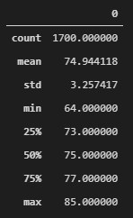
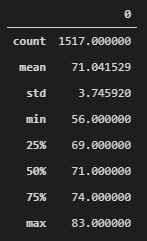

# surfs_up

## Project Overview
W. Avy is an investor interested in investing in a new business venture called "Surf n' Shake" located in Hawaii: a shop that sells surfing supplies and ice cream to locals and tourists. Mr. Avy has come to me to run some data analytics on some weather data to make sure the proposed area is a viable location throughout the year.

## Resources
- Data: 
	- /hawaii.sqlite
- Software: 
	- SQLite
	- SQLAlchemy
	- Python 3.7.10
	
## Results
### June Temperature analysis

### December Temperature analysis

- The mean temperatures of June (74.9°F) and December (71.0°F) only have a difference of 3.9°F.
- The max temperatures of June (85°F) and December (83°F) differ by only 2°F.
- The minimum temperatures of June (64°F) and December (56°F) have the largest difference of 8°F.

## Summary
Looking at the two statistical summaries, we can see that the temperatures of the two months are very similar. The consistent temperature fluctuations throughout the year would allow for steady business from both surfers looking for nice weather, and ice cream eaters. For additional insight, we could potentially create a line chart for the temperatures throughout the years to have a better understanding of yearly temperature changes. Analysis on the amount of precipitation throughout the year would yield valuable insight on the viability of the location.